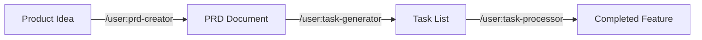

# Task Management Prompts

These prompts form a complete development workflow optimized for Claude Code's capabilities.

## Workflow Overview



## Available Prompts

### 1. PRD Creator (`/user:prd-creator`)
Transforms product ideas into comprehensive Product Requirements Documents.

**Key Improvements:**
- **Codebase Analysis**: Examines existing code before asking questions
- **Smart Questions**: Asks context-aware questions based on your actual codebase
- **File Integration**: References specific files and suggests implementation locations
- **Auto-save**: Creates PRD files in `docs/prd/` directory

**Usage:**
```
/user:prd-creator

I want to add a real-time notification system to our app
```

### 2. Task Generator (`/user:task-generator`)
Breaks down PRDs into actionable, well-structured development tasks.

**Key Improvements:**
- **TodoWrite Integration**: Automatically loads tasks into Claude's task system
- **Dependency Mapping**: Creates clear task execution order
- **Time Estimates**: Provides realistic estimates based on complexity
- **Test-First**: Generates test tasks before implementation tasks
- **File-Specific**: Every task lists exact files to modify/create

**Usage:**
```
/user:task-generator

Please generate tasks from docs/prd/notification-system-prd.md
```

### 3. Task Processor (`/user:task-processor`)
Executes tasks systematically with progress tracking and clear communication.

**Key Improvements:**
- **Native Task Management**: Uses TodoRead/TodoWrite for progress tracking
- **Smart Execution**: Checks dependencies and parallelization opportunities
- **Error Recovery**: Handles missing dependencies and test failures gracefully
- **Progress Updates**: Provides structured updates with file changes and test results
- **Commit Guidance**: Suggests logical points for version control commits

**Usage:**
```
/user:task-processor

Execute the notification system tasks starting with TASK-001
```

## Complete Workflow Example

### Step 1: Create PRD
```
/user:prd-creator

I need a user authentication system with email/password and OAuth support
```

Claude will:
1. Analyze your codebase structure
2. Ask targeted questions about security, user flow, and integration
3. Generate comprehensive PRD
4. Save to `docs/prd/auth-system-prd.md`

### Step 2: Generate Tasks
```
/user:task-generator

Generate tasks from docs/prd/auth-system-prd.md
```

Claude will:
1. Break down PRD into 1-4 hour tasks
2. Create dependency graph
3. Load tasks into TodoWrite system
4. Provide execution order recommendation

### Step 3: Execute Tasks
```
/user:task-processor

Start executing the auth system tasks
```

Claude will:
1. Check task dependencies
2. Update task status in real-time
3. Implement code following your patterns
4. Run tests and report results
5. Provide progress summaries

## Key Differences from Original Prompts

### PRD Creator
- **Original**: Generic questions and template
- **Enhanced**: Codebase-aware with intelligent, contextual questions

### Task Generator  
- **Original**: Markdown task list with manual tracking
- **Enhanced**: Integrated with Claude's TodoWrite system, includes file references

### Task Processor
- **Original**: Basic execution with manual status updates
- **Enhanced**: Automated progress tracking, error recovery, and test integration

## Best Practices

1. **Always start with PRD Creator** for new features
2. **Review generated tasks** before execution
3. **Let Task Processor handle dependencies** automatically
4. **Check progress with TodoRead** at any time
5. **Commit completed task groups** as logical units

## Advanced Usage

### Partial Execution
```
/user:task-processor

Execute only the setup and test tasks (TASK-001 through TASK-005)
```

### Task Modification
```
Let me modify TASK-003 to include API documentation
[Claude updates task in TodoWrite]
```

### Progress Check
```
Show me the current task progress
[Claude uses TodoRead to display status]
```

These prompts transform Claude Code into an intelligent development partner that understands your codebase and manages the entire feature development lifecycle.